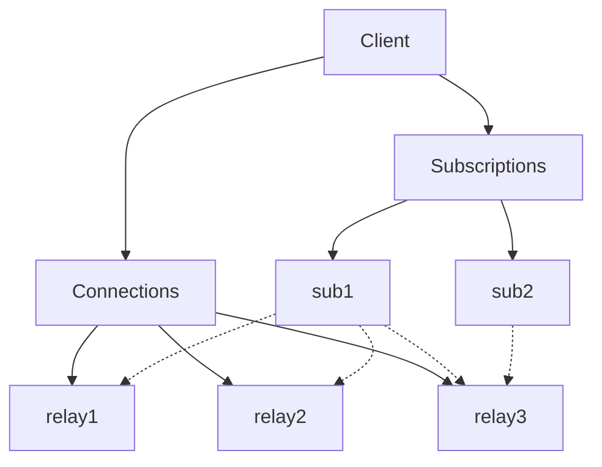

# Nostr

Nostr client intended to be run on server for just one user

## How to run

1. Create your `.env` file

   ```bash
   cp template.env .env
   ```

2. Paste your private key to the `.env` file
3. Export the `.env` - the easies way is to install [direnv](https://direnv.net/) which will do it
   automatically for you (you need to
   [enable](https://direnv.net/man/direnv.toml.1.html#codeloaddotenvcode) exporting `.env` files)
4. Install deps `mix deps.get`
5. Start Phoenix server `mix phx.server`
6. Go to <http://localhost:4000/nostr>

## Supervision tree

### Client

Client is `GenServer` which upon startup spawns two `DynamicSupervisor`s:

- `Connections` which supervises all active WebSocket connections
- `Subscriptions` which supervises all active Nostr subscriptions

Each subscription is executed inside in one or more connections.

Each relay connection is sending received messages to corresponding subscription process which is
handling de-duplication and sending it to handler process.

Each relay connection is identified by the URL and is concerned only with sending and receiving
messages through WebSocket.

Subscription process is handling encoding/decoding.


